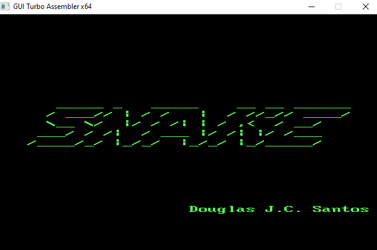
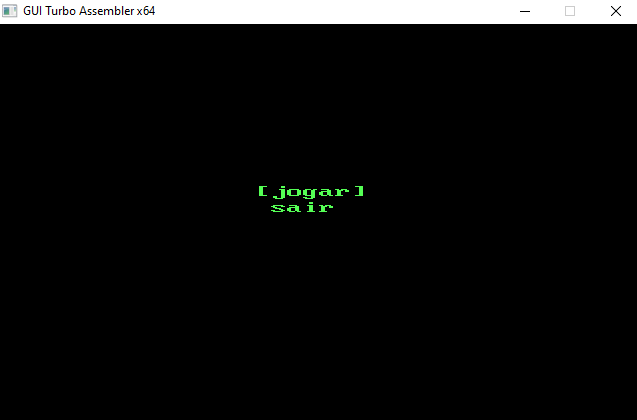
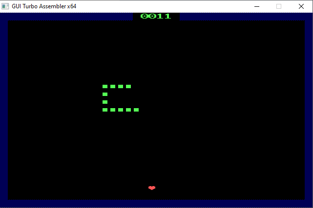
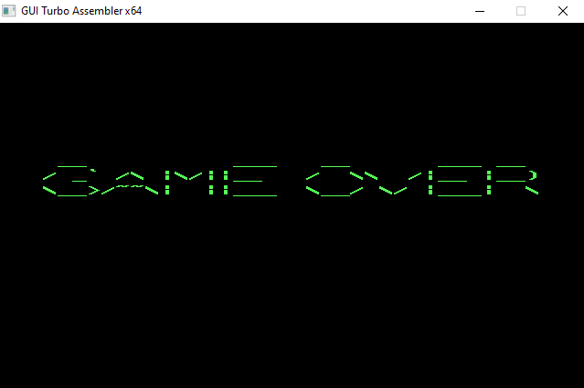
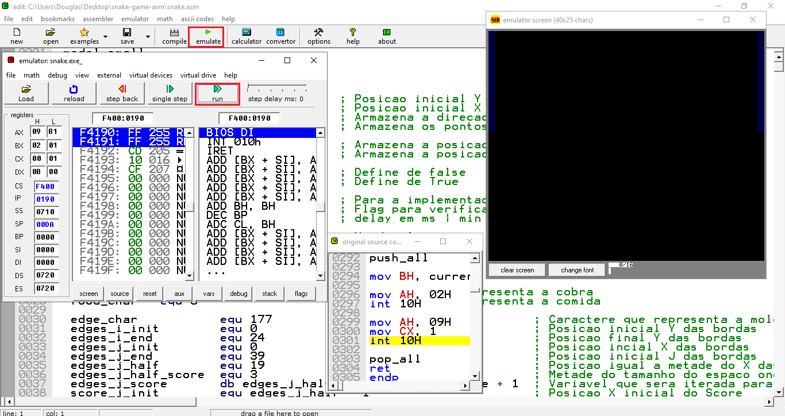
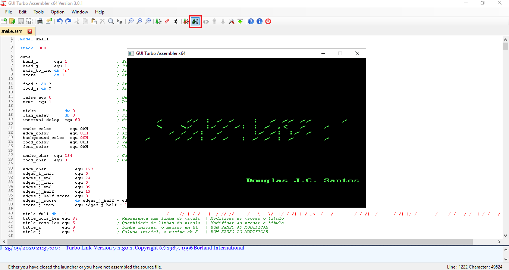

# Snake Game ASM

The snake game developed in ASM 8086

## 💻 Project

#### Welcome screen



#### Menu



#### Game screen



#### Game over



## 🚀 Technologies

This project was developed with the following technologies:

 ASM 8086

## 🏃 Usage

To run this application you have two options:

- Run in **debug** mode (_slower but you can watch values inside registers_)
- Run in **production** mode (_faster but you can't watch values inside registers_)

### Debug Mode

First of all, you have to install <a href="https://emu8086-microprocessor-emulator.en.softonic.com/download">emu8086</a> and clone this repository with:

```bash
git clone https://github.com/douglasJovenil/snake-game-asm
```

- Now open **emu8086** and open the **snake.asm**, you find this file inside the repository you just cloned
- Inside the **emu8086** click on **emulate**, when you do this a window will open, in this window click on **run**



### Production Mode

To run this mode you have to install <a href="https://sourceforge.net/projects/guitasm8086">GUI Turbo Assembler</a> and clone this repository with:

```bash
git clone https://github.com/douglasJovenil/snake-game-asm
```

- Open **GUI Turbo Assembler** and open the **snake.asm**, you find this file inside the repository you just cloned
- Inside the **GUI Turbo Assembler** click on **assemble, build executable and run program**


